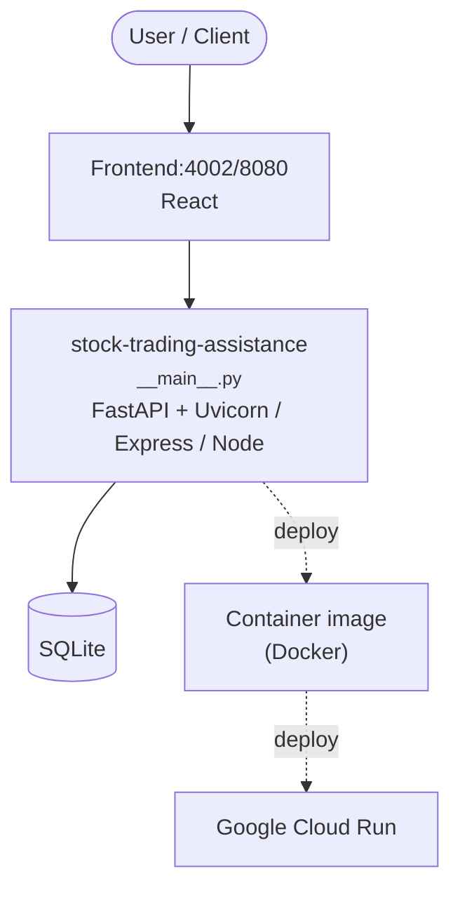

# argo — Stock Research & Trading Assistant (Phase 1)

Phase 1 of the stock research and trading assistant described in [`PRD.md`](PRD.md).

> **Not investment advice.** Personal-use research tool. Paper trading only by default.
> Read the PRD before changing anything.

## What ships today

The full **research → propose → human-approved-execute** loop for both **stock** and
**multi-leg options strategies**, accessible three ways:

1. **CLI** (`argo …`) — for local use.
2. **HTTP API** (FastAPI) — for headless / scripted use.
3. **React web UI** (`/ui/`) — for interactive analysis.

All three drive the same Python core:
- `edgartools` → 10-K (Item 1, 1A, 7) + companyfacts fundamentals.
- `yfinance` → price, 50-day SMA, 200-day SMA, 6-month return, option chains.
- `py_vollib_vectorized` → Black-Scholes Greeks (delta, gamma, theta, vega) + IV.
- `optionlab` → PoP, breakevens, max-loss / max-gain (with closed-form fallback).
- Built-in strategy selector → matches thesis × IV-regime to one of 7 templates
  (long call/put, bull-call spread, short-put vertical, iron condor, covered call,
  cash-secured put).
- Claude Opus 4.7 (with prompt caching) → one-page thesis.
- `alpaca-py` → stock + multi-leg options paper trading (Alpaca Level 3).
- SQLite → research / tickets (with `legs_json`, `analysis_json`) / executions audit log.

## Quick start (local)

```bash
uv venv && source .venv/bin/activate
uv pip install -e ".[dev,server]"
cp .env.example .env  # fill in ANTHROPIC_API_KEY, ALPACA_API_KEY/SECRET, SEC_USER_AGENT

# 1. Research a ticker
argo research NVDA

# 2a. Stock proposal (Phase 0)
argo propose NVDA --capital 500

# 2b. Options proposal (Phase 1) — selector picks the template
argo propose-options NVDA                       # uses thesis from latest research
argo propose-options AAPL --strategy iron_condor --dte 35 --width 5 --qty 1
argo propose-options TSLA --strategy short_put_vertical --delta 0.25 --width 10

# 3. List templates / chain expiries
argo strategies
argo expiries NVDA

# 4. Approve and execute
argo tickets
argo execute TKT-001 --confirm

# Halt: cancel all open orders + block pending tickets
argo halt

# API + UI
uvicorn argo.server:app --reload --port 8080
# API docs: http://localhost:8080/docs
# UI:       http://localhost:8080/ui/

# Frontend dev (hot reload, proxies API to localhost:8080):
cd frontend && npm install && npm run dev
```

## Configuration

| Var | Default | Meaning |
|---|---|---|
| `ANTHROPIC_API_KEY` | — | Required. Used for thesis LLM calls. |
| `ANTHROPIC_MODEL` | `claude-opus-4-7` | Override if you want Sonnet/Haiku for cost. |
| `ALPACA_API_KEY` / `ALPACA_SECRET_KEY` | — | Required. Free paper keys at https://alpaca.markets/. |
| `ALPACA_PAPER` | `true` | If `false`, hits live trading. **Do not flip until Phase 2.** |
| `SEC_USER_AGENT` | — | Required by SEC EDGAR — `Name email@example.com`. |
| `ARGO_MAX_NOTIONAL_USD` | `500` | Hard cap on a single trade's notional. |
| `ARGO_DATA_DIR` | `~/.argo` | SQLite + saved research location. |

## Strategy selector cheat-sheet

The selector picks a template from `thesis_direction × IV_rank`:

|                | bullish              | bearish    | neutral                  |
|----------------|----------------------|------------|--------------------------|
| **IV rich** (≥60) | short put vertical   | long put   | iron condor              |
| **IV neutral**    | bull call spread     | long put   | covered call (or condor) |
| **IV cheap** (≤30)| long call            | long put   | covered call             |

Override with `--strategy <key>`, target delta with `--delta`, spread width with
`--width`, expiry with `--dte`. Pass `--own-shares` to enable covered-call picks.

## Guardrails

- Paper trading only by default.
- $500/trade notional cap, re-checked with a fresh quote at execution time.
- For options: the cap is applied against the **max loss** computed at proposal time
  (per-contract × qty), and re-validated against the stored max loss at execute time.
- Typed-confirmation execute — `APPROVE <TICKER> <TICKET_ID>` exactly.
- `argo halt` (CLI) or `POST /halt` (API) — cancels all open orders, blocks pending tickets.

## Deploy to Google Cloud Run

The repo includes a [`cloudbuild.yaml`](cloudbuild.yaml) and a multi-stage [`Dockerfile`](Dockerfile)
that builds the React SPA, bundles it into the FastAPI image, and deploys to Cloud Run.

### One-time setup

```bash
gcloud services enable run.googleapis.com artifactregistry.googleapis.com \
                       cloudbuild.googleapis.com secretmanager.googleapis.com

gcloud artifacts repositories create argo \
    --repository-format=docker --location=us-central1

# Secrets
printf 'sk-ant-...'        | gcloud secrets create argo-anthropic-api-key  --data-file=-
printf 'PK...'             | gcloud secrets create argo-alpaca-api-key     --data-file=-
printf '...'               | gcloud secrets create argo-alpaca-secret-key  --data-file=-
printf 'Name email@x.com'  | gcloud secrets create argo-sec-user-agent     --data-file=-

# IAM (one-time)
PROJECT=$(gcloud config get-value project)
PROJECT_NUMBER=$(gcloud projects describe "$PROJECT" --format='value(projectNumber)')

gcloud projects add-iam-policy-binding "$PROJECT" \
    --member="serviceAccount:${PROJECT_NUMBER}@cloudbuild.gserviceaccount.com" \
    --role="roles/run.admin"
gcloud projects add-iam-policy-binding "$PROJECT" \
    --member="serviceAccount:${PROJECT_NUMBER}@cloudbuild.gserviceaccount.com" \
    --role="roles/iam.serviceAccountUser"

for s in argo-anthropic-api-key argo-alpaca-api-key argo-alpaca-secret-key argo-sec-user-agent; do
  gcloud secrets add-iam-policy-binding "$s" \
      --member="serviceAccount:${PROJECT_NUMBER}-compute@developer.gserviceaccount.com" \
      --role="roles/secretmanager.secretAccessor"
done
```

### Build + deploy

```bash
gcloud builds submit --config cloudbuild.yaml
```

### Reach the service

By default Cloud Run deploys with `--no-allow-unauthenticated`. Use the proxy:

```bash
gcloud run services proxy argo --region=us-central1
# Then open http://localhost:8080/ui/ in your browser.
```

To deploy public (e.g. for a demo), override the substitution:

```bash
gcloud builds submit --config cloudbuild.yaml \
    --substitutions=_ALLOW_UNAUTH=true
```

### Caveats

- **State is ephemeral.** SQLite lives in `/tmp/argo` on the container; Cloud Run cold starts
  wipe pending tickets. Acceptable for a Phase 0 demo, but **don't leave tickets unapproved
  overnight**. Phase 1+ moves state to Cloud SQL or Firestore.
- **Cold starts are slow** (~5–10s) — edgartools + yfinance take a moment to import. Set
  `--min-instances=1` if you need warmth.
- **No auth on the API endpoints themselves.** Anyone who can reach the service can execute
  paper trades up to the notional cap. Keep `_ALLOW_UNAUTH=false` and rely on Cloud Run IAM,
  or front the service with IAP, until Phase 2 adds user-level auth.

## Tests

```bash
pytest
```

22 tests covering DB, propose, execute, LLM tail parsing, and HTTP endpoints. All mock the
broker — no live API calls.

## Folder layout

```
.
├── PRD.md                  ← the full phased plan
├── pyproject.toml          ← Python package (argo CLI + server)
├── Dockerfile              ← multi-stage: node build → python serve
├── cloudbuild.yaml         ← Cloud Build → Cloud Run
├── src/argo/
│   ├── cli.py              ← Typer CLI
│   ├── server.py           ← FastAPI app, mounts SPA at /ui/
│   ├── research.py         ← edgartools + yfinance
│   ├── llm.py              ← Claude thesis generation (with prompt caching)
│   ├── propose.py          ← Thesis → ticket
│   ├── execute.py          ← Ticket → broker order, with guardrails
│   ├── db.py               ← SQLite schema + helpers
│   ├── config.py           ← env-driven settings
│   └── brokers/            ← BrokerClient protocol + Alpaca adapter
├── frontend/               ← React + Vite SPA
│   ├── src/pages/          ← Home (research+propose), Tickets, TicketDetail, Positions
│   └── src/api.ts          ← typed fetch client
└── tests/
```

## What's deliberately not in Phase 0

- Multi-leg options strategies → Phase 1
- IBKR adapter → Phase 2
- Smart-money signals (13F, insider, Congress) → Phase 3
- Backtesting → Phase 4
- Production-grade auth + persistent state → Phase 5

See [`PRD.md`](PRD.md) for the full plan.

<!-- ARCH-DIAGRAM:START -->

## Architecture

> Auto-generated architecture diagram. See [`docs/context-map.md`](docs/context-map.md) for the full context map (core application, containers/cloud, and database connections).



<!-- ARCH-DIAGRAM:END -->
