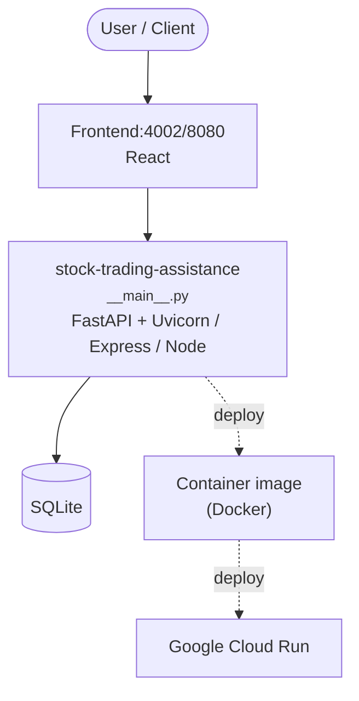

# Context Map — `stock-trading-assistance`

> Auto-generated architecture & deployment context map. Summarizes the core application, container/cloud footprint, and database connections. Regenerate after significant structural changes.

**Repo:** `avnit/stock-trading-assistance` · **Original** · Public · Primary language: Python · Default branch: `main` · Files: 56

## 1. Core application

argo — Stock Research & Trading Assistant (Phase 1)

- **Frameworks / runtime:** FastAPI + Uvicorn, Express / Node, React
- **Entry points:** `src/argo/__main__.py`, `src/argo/server.py`
- **Listens on port(s):** 4002, 8080

## 2. Containers & cloud applications

**Containers:**
- `.dockerignore`
- `Dockerfile`

**Cloud deploy / serverless manifests:**
- `cloudbuild.yaml`

**Detected cloud platforms / services:** Google Cloud Run

## 3. Database connections

**Datastores in use:** SQLite

**Referenced in:**
- `src/argo/db.py`

**Environment / config files:** `.env.example`

## 4. Architecture diagram

## 5. Security posture

- **Dependabot alerts (open):** 1 high, 1 medium
- **Static scan findings:** 1 high, 1 low

| Severity | Rule | File:Line |
|---|---|---|
| high | sql-string-concat | `src/argo/db.py:71` |
| low | py-bind-all-interfaces | `Dockerfile:39` |

---
_Generated by repo context-mapping pass on 2026-08-13._